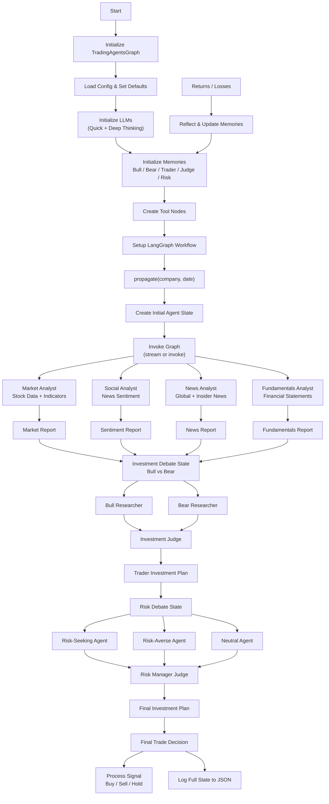

# Gekko: Embabel Trading Agent

---

<table>
<tr>
<td width="200">

</td>
<td>

**Gekko** is a research-oriented framework designed to decompose trading workflows into specialized agents (Analysts,
Researchers, Trader, Risk Manager, Portfolio Manager). The goal is to provide a modular, extensible codebase for
experimenting with multi-agent LLM coordination on market analysis and trade decision tasks.
It demonstrates the power of the [Embabel agent framework](https://www.github.com/embabel/embabel-agent).

```mermaid
flowchart TD
%% =======================
%% Entry & Initialization
%% =======================
    START["Start"]
    INIT["Initialize TradingAgentsGraph"]
    CONFIG["Load Config & Set Defaults"]
    LLM["Initialize LLMs<br/>(Quick + Deep Thinking)"]
    MEM["Initialize Memories<br/>Bull / Bear / Trader / Judge / Risk"]
    TOOLS["Create Tool Nodes"]
    GRAPH["Setup LangGraph Workflow"]
    START --> INIT
    INIT --> CONFIG
    CONFIG --> LLM
    LLM --> MEM
    MEM --> TOOLS
    TOOLS --> GRAPH
%% =======================
%% Propagation Phase
%% =======================
    PROP["propagate(company, date)"]
    INIT_STATE["Create Initial Agent State"]
    INVOKE["Invoke Graph<br/>(stream or invoke)"]
    GRAPH --> PROP
    PROP --> INIT_STATE
    INIT_STATE --> INVOKE
%% =======================
%% Conditional Analyst Selection
%% =======================
    COND_ANALYSTS["ConditionalLogic<br/>Select Enabled Analysts"]
    INVOKE --> COND_ANALYSTS
    COND_ANALYSTS -->|Market Enabled| MARKET
    COND_ANALYSTS -->|Social Enabled| SOCIAL
    COND_ANALYSTS -->|News Enabled| NEWS
    COND_ANALYSTS -->|Fundamentals Enabled| FUND
%% =======================
%% Analyst Data Collection
%% =======================
    MARKET["Market Analyst<br/>Stock Data + Indicators"]
    SOCIAL["Social Analyst<br/>News Sentiment"]
    NEWS["News Analyst<br/>Global + Insider News"]
    FUND["Fundamentals Analyst<br/>Financial Statements"]
%% =======================
%% Reports Aggregation
%% =======================
    MARKET --> MKT_REP
    SOCIAL --> SENT_REP
    NEWS --> NEWS_REP
    FUND --> FUND_REP
    MKT_REP["Market Report"]
    SENT_REP["Sentiment Report"]
    NEWS_REP["News Report"]
    FUND_REP["Fundamentals Report"]
%% =======================
%% Conditional Report Sufficiency
%% =======================
    COND_REPORTS["ConditionalLogic<br/>Are Reports Sufficient?"]
    MKT_REP --> COND_REPORTS
    SENT_REP --> COND_REPORTS
    NEWS_REP --> COND_REPORTS
    FUND_REP --> COND_REPORTS
    COND_REPORTS -->|Yes| INVEST_DEBATE
    COND_REPORTS -->|No| EARLY_EXIT
    EARLY_EXIT["Early Exit<br/>Insufficient Signal"]
    EARLY_EXIT --> FINAL_DECISION
%% =======================
%% Investment Debate
%% =======================
    INVEST_DEBATE["Investment Debate State<br/>Bull vs Bear"]
    BULL["Bull Researcher"]
    BEAR["Bear Researcher"]
    INVEST_JUDGE["Investment Judge"]
    INVEST_DEBATE --> BULL
    INVEST_DEBATE --> BEAR
    BULL --> INVEST_JUDGE
    BEAR --> INVEST_JUDGE
%% =======================
%% Conditional Investment Outcome
%% =======================
    COND_INVEST["ConditionalLogic<br/>Strong Conviction?"]
    INVEST_JUDGE --> COND_INVEST
    COND_INVEST -->|Reject| FINAL_DECISION
    COND_INVEST -->|Approve| TRADER_PLAN
    TRADER_PLAN["Trader Investment Plan"]
%% =======================
%% Risk Debate
%% =======================
    COND_RISK["ConditionalLogic<br/>Risk Review Required?"]
    TRADER_PLAN --> COND_RISK
    COND_RISK -->|No| FINAL_PLAN
    COND_RISK -->|Yes| RISK_DEBATE
    RISK_DEBATE["Risk Debate State"]
    RISKY["Risk-Seeking Agent"]
    SAFE["Risk-Averse Agent"]
    NEUTRAL["Neutral Agent"]
    RISK_JUDGE["Risk Manager Judge"]
    RISK_DEBATE --> RISKY
    RISK_DEBATE --> SAFE
    RISK_DEBATE --> NEUTRAL
    RISKY --> RISK_JUDGE
    SAFE --> RISK_JUDGE
    NEUTRAL --> RISK_JUDGE
%% =======================
%% Final Decision
%% =======================
    RISK_JUDGE --> FINAL_PLAN
    FINAL_PLAN["Final Investment Plan"]
    FINAL_PLAN --> FINAL_DECISION
    FINAL_DECISION["Final Trade Decision"]
    FINAL_DECISION --> SIGNAL
    SIGNAL["Process Signal<br/>Buy / Sell / Hold"]
%% =======================
%% Logging
%% =======================
    FINAL_DECISION --> LOG
    LOG["Log Full State to JSON"]
%% =======================
%% Reflection & Memory
%% =======================
    RETURNS["Returns / Losses"]
    REFLECT["Reflect & Update Memories"]
    RETURNS --> REFLECT
    REFLECT --> MEM

```

```mermaid
flowchart TD
%% =======================
%% Global State
%% =======================
    STATE["AgentState<br/>(Global Graph State)"]
%% =======================
%% Entry
%% =======================
    START["START"]
    START --> STATE
%% =======================
%% Analyst Subgraph
%% =======================
    subgraph ANALYSTS["Analyst Collection (ConditionalLogic Router)"]
        direction TB
        ROUTE_ANALYSTS["route_analysts(state)<br/>ConditionalLogic"]
        MARKET["Market Analyst Node"]
        SOCIAL["Social Analyst Node"]
        NEWS["News Analyst Node"]
        FUND["Fundamentals Analyst Node"]
        ROUTE_ANALYSTS -->|market| MARKET
        ROUTE_ANALYSTS -->|social| SOCIAL
        ROUTE_ANALYSTS -->|news| NEWS
        ROUTE_ANALYSTS -->|fundamentals| FUND
    end

    STATE --> ROUTE_ANALYSTS
%% =======================
%% Reports Written to AgentState
%% =======================
    MARKET --> STATE
    SOCIAL --> STATE
    NEWS --> STATE
    FUND --> STATE
%% =======================
%% Report Sufficiency Gate
%% =======================
    subgraph REPORT_GATE["Report Sufficiency Gate"]
        ROUTE_REPORTS["route_on_reports(state)<br/>ConditionalLogic"]
        ROUTE_REPORTS -->|sufficient| INVEST_DEBATE
        ROUTE_REPORTS -->|insufficient| FINAL_DECISION
    end

    STATE --> ROUTE_REPORTS
%% =======================
%% Investment Debate Subgraph
%% =======================
    subgraph INVEST_DEBATE["Investment Debate Graph"]
        direction TB
        INV_STATE["InvestDebateState"]
        BULL["Bull Researcher"]
        BEAR["Bear Researcher"]
        INVEST_JUDGE["Investment Judge"]
        INV_STATE --> BULL
        INV_STATE --> BEAR
        BULL --> INVEST_JUDGE
        BEAR --> INVEST_JUDGE
        INVEST_JUDGE --> INV_STATE
    end

%% LangGraph edge
    ROUTE_REPORTS -->|sufficient| INV_STATE
    INV_STATE --> STATE
%% =======================
%% Investment Conviction Gate
%% =======================
    subgraph INVEST_GATE["Investment Conviction Gate"]
        ROUTE_INVEST["route_on_investment(state)<br/>ConditionalLogic"]
        ROUTE_INVEST -->|approve| TRADER
        ROUTE_INVEST -->|reject| FINAL_DECISION
    end

    STATE --> ROUTE_INVEST
%% =======================
%% Trader Node
%% =======================
    TRADER["Trader Agent"]
    TRADER --> STATE
%% =======================
%% Risk Debate Subgraph
%% =======================
    subgraph RISK_GATE["Risk Review Gate"]
        ROUTE_RISK["route_on_risk(state)<br/>ConditionalLogic"]
        ROUTE_RISK -->|required| RISK_DEBATE
        ROUTE_RISK -->|skip| FINAL_DECISION
    end

    STATE --> ROUTE_RISK

    subgraph RISK_DEBATE["Risk Debate Graph"]
        direction TB
        RISK_STATE["RiskDebateState"]
        RISKY["Risk-Seeking Agent"]
        SAFE["Risk-Averse Agent"]
        NEUTRAL["Neutral Agent"]
        RISK_JUDGE["Risk Manager Judge"]
        RISK_STATE --> RISKY
        RISK_STATE --> SAFE
        RISK_STATE --> NEUTRAL
        RISKY --> RISK_JUDGE
        SAFE --> RISK_JUDGE
        NEUTRAL --> RISK_JUDGE
        RISK_JUDGE --> RISK_STATE
    end

    ROUTE_RISK -->|required| RISK_STATE
    RISK_STATE --> STATE
%% =======================
%% Final Decision
%% =======================
    FINAL_DECISION["Final Trade Decision Node"]
    STATE --> FINAL_DECISION
%% =======================
%% End
%%

```

```mermaid
flowchart TD
%% =======================
%% Global State
%% =======================
    STATE["AgentState"]
    START["START"] --> STATE
%% =======================
%% Market Analyst Loop
%% =======================
    subgraph MARKET_LOOP["Market Analyst Loop"]
        MARKET["Market Analyst"]
        MARKET_ROUTER["should_continue_market(state)"]
        MARKET --> MARKET_ROUTER
        MARKET_ROUTER -->|tools_market| MARKET
        MARKET_ROUTER -->|Msg Clear Market| STATE
    end

    STATE --> MARKET
%% =======================
%% Social Analyst Loop
%% =======================
    subgraph SOCIAL_LOOP["Social Analyst Loop"]
        SOCIAL["Social Analyst"]
        SOCIAL_ROUTER["should_continue_social(state)"]
        SOCIAL --> SOCIAL_ROUTER
        SOCIAL_ROUTER -->|tools_social| SOCIAL
        SOCIAL_ROUTER -->|Msg Clear Social| STATE
    end

    STATE --> SOCIAL
%% =======================
%% News Analyst Loop
%% =======================
    subgraph NEWS_LOOP["News Analyst Loop"]
        NEWS["News Analyst"]
        NEWS_ROUTER["should_continue_news(state)"]
        NEWS --> NEWS_ROUTER
        NEWS_ROUTER -->|tools_news| NEWS
        NEWS_ROUTER -->|Msg Clear News| STATE
    end

    STATE --> NEWS
%% =======================
%% Fundamentals Analyst Loop
%% =======================
    subgraph FUND_LOOP["Fundamentals Analyst Loop"]
        FUND["Fundamentals Analyst"]
        FUND_ROUTER["should_continue_fundamentals(state)"]
        FUND --> FUND_ROUTER
        FUND_ROUTER -->|tools_fundamentals| FUND
        FUND_ROUTER -->|Msg Clear Fundamentals| STATE
    end

    STATE --> FUND
%% =======================
%% Investment Debate Loop
%% =======================
    subgraph INVEST_DEBATE["Investment Debate"]
        INV_STATE["InvestDebateState"]
        BULL["Bull Researcher"]
        BEAR["Bear Researcher"]
        INVEST_ROUTER["should_continue_debate(state)"]
        INV_STATE --> BULL
        INV_STATE --> BEAR
        BULL --> INVEST_ROUTER
        BEAR --> INVEST_ROUTER
        INVEST_ROUTER -->|Bull Researcher| BULL
        INVEST_ROUTER -->|Bear Researcher| BEAR
        INVEST_ROUTER -->|Research Manager| STATE
    end

    STATE --> INV_STATE
%% =======================
%% Risk Debate Loop
%% =======================
    subgraph RISK_DEBATE["Risk Debate"]
        RISK_STATE["RiskDebateState"]
        RISKY["Risky Analyst"]
        SAFE["Safe Analyst"]
        NEUTRAL["Neutral Analyst"]
        RISK_ROUTER["should_continue_risk_analysis(state)"]
        RISK_STATE --> RISKY
        RISK_STATE --> SAFE
        RISK_STATE --> NEUTRAL
        RISKY --> RISK_ROUTER
        SAFE --> RISK_ROUTER
        NEUTRAL --> RISK_ROUTER
        RISK_ROUTER -->|Risky Analyst| RISKY
        RISK_ROUTER -->|Safe Analyst| SAFE
        RISK_ROUTER -->|Neutral Analyst| NEUTRAL
        RISK_ROUTER -->|Risk Judge| STATE
    end

    STATE --> RISK_STATE
%% =======================
%% Final Decision
%% =======================
    FINAL["Final Trade Decision"]
    STATE --> FINAL
    FINAL --> END["END"]
```

</td>
</tr>
</table>

